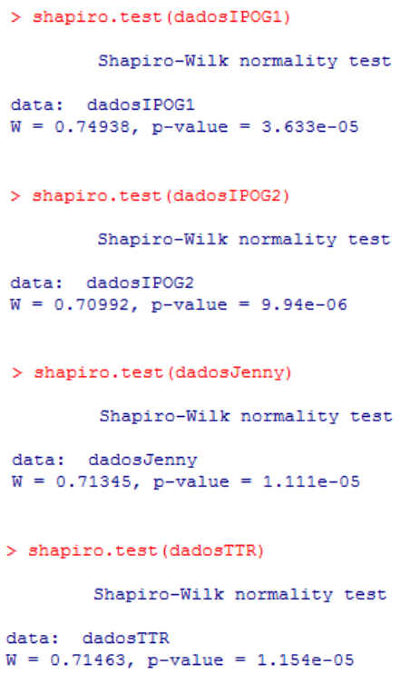
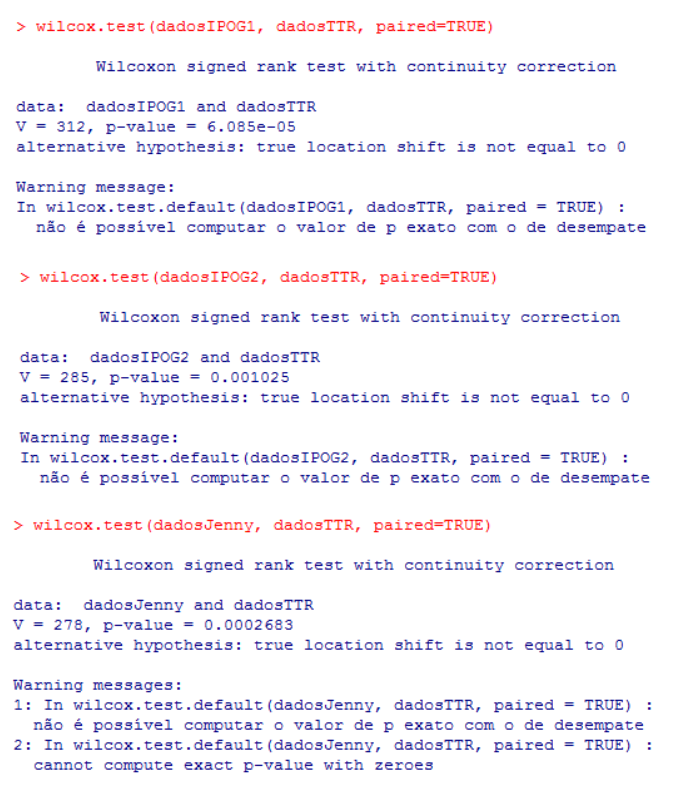
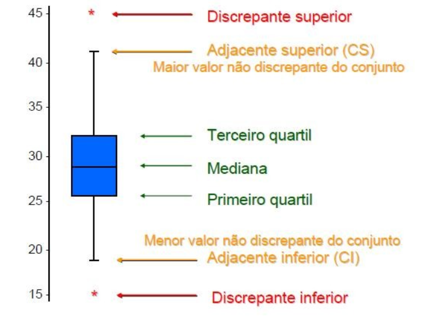

> **Status do projeto:** completo :heavy_check_mark:  
> **Autor:** Juliana Marino Balera :busts_in_silhouette:

# Teste de Hipótese :bar_chart:

## 1. Procedimento :arrow_forward:

### 1.1 Verificar a normalidade dos dados

Para verificar a normalidade dos dados, é necessário utilizar o método de
*Shapiro-Wilk*, com nível de significância 0.05 (definição padrão). Na
linguagem R, a função shapiro.test(conjunto_dados) retorna o *p-value* para
esse conjunto de dados.

Definição 1.1.1 – *p-value* : diz quais são as chances de que a amostra vem
de uma distribuição normal. Quanto menor o valor, menor as chances.

Com o valor do *p-value* em mãos, basta comparar com o nível de
significância definido. No caso, se o p-value for menor que 0.05, isso
significa que a amostra não possuí distribuição normal. Caso contrário,
significa que possuí distribuição normal.

De acordo com os testes acima, todas as amostras não são distribuídas
normalmente, logo, para verificar as hipóteses, utilizaremos o teste de
*Wilcoxon signed rank*.

### 1.2 Teste de Hipótese

Após a etapa anterior, é necessário verificar se a hipótese nula pode ser
descartada ou não. De acordo com a natureza dos resultados obtidos no
item anterior, vamos utilizar o teste de *Wilcoxon (Signed-Rank)* com nível
de significância 0.05. Esse teste está implementado na linguagem R, e pode
ser utilizado a partir da função wilcox.test(.dados1, dados2,
paried=TRUE).

## 2. Como ler um BoxPlot :interrobang:

# Revisão Bibliográfica e Links Úteis :books:

**Título:** Diferenças entre os testes paramétricos e os não-paramétricos  
**Autores:** Desconhecido  
**Tipo de Publicação:** Página Web  
**Descrição:** Mostra a diferença entre os testes paramétrico e não
paramétrico, descrevendo os dois tipos de teste  
**Fonte:** http://analise-estatistica.pt/2012/10/diferencas-entre-os-testesparametricos-e-osnao-parametricos.html  

**Título:** EcoR  
**Autores:** USP  
**Tipo de Publicação:** Página Web  
**Descrição:** Tutorial sobre como usar a linguagem R. Além disso, aulas
sobre estatística básica com aplicações da linguagem R. 
**Fonte:** http://ecologia.ib.usp.br/bie5782/doku.php?id=start  

**Título:** Bioestatística usando R  
**Autores:** Colin Robert Beasley  
**Tipo de Publicação:** Página Web  
**Descrição:** Apostila sobre os principais pontos da linguagem R, uteis a
bioestatística. A apostila está organizada de acordo com tópicos de
estatística uteis a biologia. 
**Fonte:** https://cran.r-project.org/doc/contrib/Beasley-BioestatisticaUsandoR.pdf  

**Título:** How test data normality in a formal way in R. 
**Autores:** Andrie Joris e Joris Meyes  
**Tipo de Publicação:** Página Web  
**Descrição:** Explica como verificar se um conjunto de dados está
normalizado ou não, através da aplicação do método de Shapiro-Wilks em
linguagem R. 
**Fonte:** www.dummies.com/how-to/content/how-to-test-data-normality-inaformal-way-in-r.html

